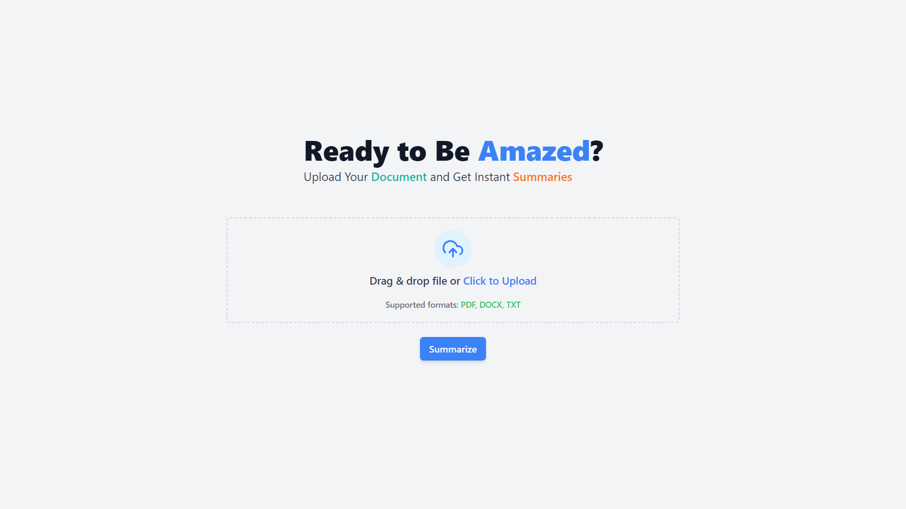
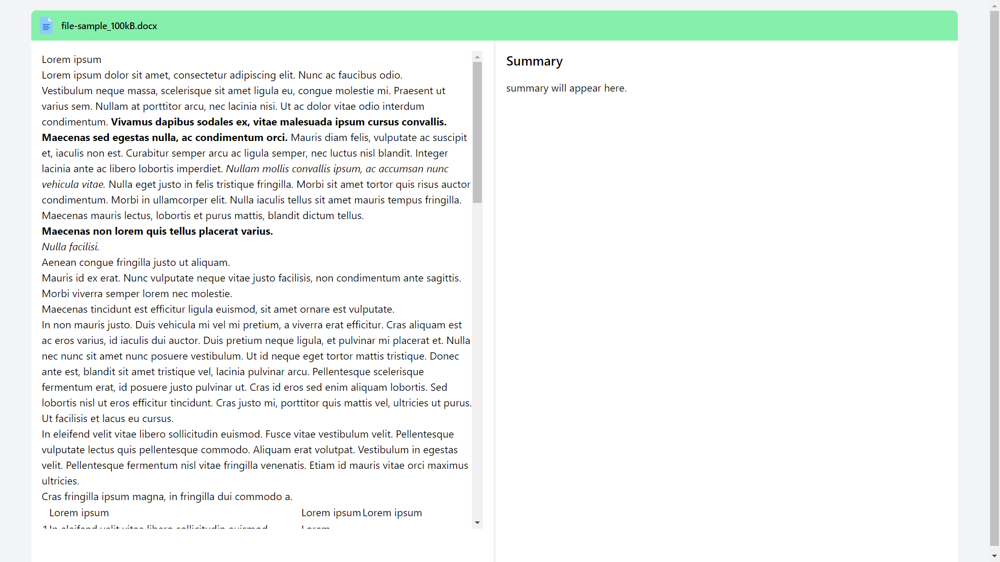

# Document Summarization Web Application

## Project Screenshot
### Home page


#### Summary Page


## Overview
This project is a web application that allows users to upload documents (PDF, DOCX, TXT) and receive summarized versions using a locally deployed Language Model (LLM). The application is built with a Python backend (using FastAPI) and a React frontend. The backend processes and summarizes the uploaded documents using a pre-trained GPT-2 model.

## Features
- Upload documents in PDF, DOCX, or TXT format.
- View the content of the uploaded document.
- Receive a summarized version of the document.
- Validate file type before uploading.

## Setup and Installation

### Backend Setup

1. **Clone the repository:**
   ```bash
   git clone https://github.com/your-username/document-summarization-app.git
   cd document-summarization-app/backend
   
2. **Set up a virtual environment:**
   ```bash
   python -m venv venv
   source venv/bin/activate   # On Windows use `venv\Scripts\activate`

3. **Install dependencies:**
    ```bash
    pip install fastapi uvicorn transformers torch python-multipart
    
4. **Run the backend server:**
      ```bash
      uvicorn main:app --reload
   
### Frontend Setup

1. **Install the required packages:**
   ```bash
   npm install

   
2. **Run the React application:**
   ```bash
   npm run dev

The frontend will be running at http://localhost:3000.   

## Usage
1. Upload a document by selecting a PDF, DOCX, or TXT file.
2. View the content of the uploaded document on the left side of the page.
3. Click on the "Summarize" button to generate a summary.
4. View the summarized text on the right side of the page.

## Approach
### Backend
The backend is developed using FastAPI. It has two main endpoints: /upload for handling file uploads and /summarize for processing and summarizing the document.
The transformers library is used to load a pre-trained GPT-2 model for text summarization. The model processes the uploaded document and generates a summary.
The backend is optimized to handle multiple concurrent requests efficiently.

### Frontend
The frontend is built using React. It includes a file upload component, which allows users to select and upload documents.
The selected document's content is displayed using the react-doc-viewer library, ensuring the correct file type is validated before uploading.
API calls are made to the backend to process and summarize the document. The summarized text is then displayed in a user-friendly manner.

## Challenges Faced
### Frontend
Displaying the Original Document:
Initially, there was a challenge in rendering the selected document (PDF, DOCX, TXT) on the frontend. This was addressed by integrating the react-doc-viewer library, which provides support for displaying different file types.
File Type Validation:
Ensuring that only PDF, DOCX, and TXT files could be uploaded was another challenge. This was resolved by implementing custom validation logic that checks the file extension before allowing the upload.
### Backend
The primary challenge was integrating the GPT-2 model and optimizing it for local deployment. The model was fine-tuned to ensure quick response times without compromising the quality of the summaries.
## Bibliography
1. FastAPI Documentation
2. React Documentation
3. Chat GPT
4. NPM
    
     
